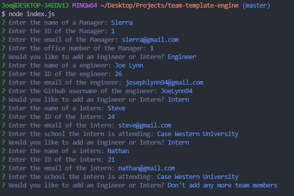
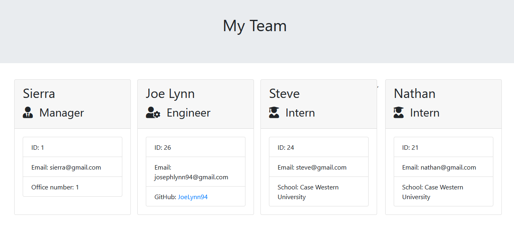
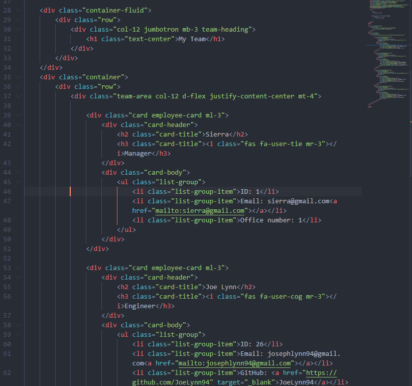

# Team Template Engine - Employee Summary

## Purpose 

As a manager - I want to generate a HTML webpage that displays my team's basic info so that I have quick access to emails and GitHub profiles The project prompts a user to build an engineering team. An engineering team consists of a manager, and any number of engineers and interns.

## Functionality

This application is built as a Node CLI that takes in information about employees and generates an HTML webpage that displays summaries for each person. The application will prompt the user for information about the team manager and then information about the team members. The user can input any number of team members, and they may be a mix of engineers and interns.

[Deployed Link](https://joelynn94.github.io/team-template-engine/) 

## App Demo

## Technologies Used 

- Node CLI 
- TDD with Jest
- JavaScript
- HTML 
- CSS

